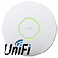

 
# ioBroker.unifi

**This adapter uses Sentry libraries to automatically report exceptions and code errors to the developers.** For more details and for information how to disable the error reporting see [Sentry-Plugin Documentation](https://github.com/ioBroker/plugin-sentry#plugin-sentry)! Sentry reporting is used starting with js-controller 3.0.

This ioBroker adapter allows the monitoring and limited controlling of [UniFi devices](http://www.ubnt.com/), such as UniFi WiFi Access Points using the public UniFi Controller Web-API.

## Configuration
###  Minimum required information
To get this adapter up and running the following information is needed:
* IP address and port of your UniFi controller (Leave the port empty in case your controller is running on UbiOS (e.g. UDM-Pro))
* Local username and password (2FA **cannot** be supported)
* Update interval

By default the information is updated every 60 seconds. Depending on your ioBroker hardware and your network size (number of clients, UniFi devices etc.) it is recommended to keep this interval and refraid from further decreasing it.

### Filter objects
The adapter updates as much information from your UniFi controller as possible, but offers the possibility to limit the updated information.

It is possible to disable the update of selected information or filter specific objects of that information.

| Information | Objects filterable by                   |
|-------------|-----------------------------------------|
| Clients     | Name, Hostname, IP address, MAC address |
| Devices     | Name, IP address, MAC address           |
| WiFis       | Name                                    |
| Networks    | Name                                    |
| Health      | Subsystem                               |

## Control
### Enable/disable WiFis
By changing the 'enabled' state of a WiFi it is possible to enable/disable it. Some seconds later the change will be provisioned to the Access Points.

### Voucher creation
Using the `vouchers.create_vouchers` button it is possible to create predefined vouchers. It is possible to configure the number of vouchers that will be created, the duration the vouchers are valid and also set limits for up- and download.

## Missing datapoints
The adapter uses [node-unifi](https://github.com/jens-maus/node-unifi) to connect to your UniFi Controller. To simplify things, not all availble datapoints are pulled into your ioBroker. In case you're missing datapoints, use the following URLs to check the API. (Note: You have to replace IP, PORT and SITE with your settings)

| Information | API URL                                     |
|-------------|---------------------------------------------|
| Sites       | https://IP:PORT/api/self/sites              |
| SysInfo     | https://IP:PORT/api/s/SITE/stat/sysinfo     |
| Clients     | https://IP:PORT/api/s/SITE/stat/sta         |
| Devices     | https://IP:PORT/api/s/SITE/stat/device      |
| WiFis       | https://IP:PORT/api/s/SITE/rest/wlanconf    |
| Networks    | https://IP:PORT/api/s/SITE/rest/networkconf |
| Health      | https://IP:PORT/api/s/SITE/stat/health      |
| Vouchers    | https://IP:PORT/api/s/SITE/stat/voucher     |
| DPI         | https://IP:PORT/api/s/SITE/stat/dpi         |
| Alarms      | https://IP:PORT/api/s/SITE/stat/alarm       |

### UbiOS/UDM-Pro endpoints

| Information | API URL                                              |
|-------------|------------------------------------------------------|
| Sites       | https://IP/proxy/network/api/self/sites              |
| SysInfo     | https://IP/proxy/network/api/s/SITE/stat/sysinfo     |
| Clients     | https://IP/proxy/network/api/s/SITE/stat/sta         |
| Devices     | https://IP/proxy/network/api/s/SITE/stat/device      |
| WiFis       | https://IP/proxy/network/api/s/SITE/rest/wlanconf    |
| Networks    | https://IP/proxy/network/api/s/SITE/rest/networkconf |
| Health      | https://IP/proxy/network/api/s/SITE/stat/health      |
| Vouchers    | https://IP/proxy/network/api/s/SITE/stat/voucher     |
| DPI         | https://IP/proxy/network/api/s/SITE/stat/dpi         |
| Alarms      | https://IP/proxy/network/api/s/SITE/stat/alarm       |

## Known issues
* The is_wired state of clients is incorrect after a client went offline. This is a known issue of the UniFi controller and is not related to the adapter. (see https://community.ui.com/questions/Wireless-clients-shown-as-wired-clients/49d49818-4dab-473a-ba7f-d51bc4c067d1)

## Changelog
<!--
    Placeholder for the next version (at the beginning of the line):
    ### **WORK IN PROGRESS**
-->
### **WORK IN PROGRESS**
* IMPRTANT: js-controller 2.0 or higher is required
* (Apollon77) Migrate to new version of unifi library
* (Apollon77) Add experimental support for Events
* (Apollon77) Allow to specify if SSL error should be ignored or not  (Default is to ignore errors as in former versions)
* (jens-maus) Fixed more device state object definitions to get rid of state warnings.
* (jens-maus/Apollon77) Updated dependencies.

### 0.5.10 (2021-05-27)
* (jens-maus) Changed "Update done" output to be output as debug info.
* (jens-maus) Updated dependencies.

### 0.5.9 (2021-05-07)
* (jens-maus) Fixed all js-controller 3.3 related state warnings
* (kirovilya, jens-maus) Added device state object with dedicated states list.
* (jens-maus) Updated node-unifi to latest version
* (jens-maus) Updated dependencies

### 0.5.8 (2020-08-29)
* (braindead1) Fixed problems related to unused sites
* (braindead1) Fixed some errors reported via Sentry

### 0.5.7 (2020-07-27)
* (braindead1) Fixed Sentry errors caused by not updated configuration after update

### 0.5.6 (2020-07-25)
* (Scrounger, braindead1) Implemented Alarms, DPI & Gateway Traffic
* (braindead1) Prevented creation of ghost clients caused by iOS MAC randomization
* (dklinger) Implemented manual update trigger
* (braindead1) Implemented deletion of used vouchers
* (braindead1) Fixed some errors reported via Sentry

### 0.5.5 (2020-06-13)
* (braindead1) Fixed some errors reported via Sentry

### 0.5.4 (2020-06-06)
* (braindead1) Implemented offset for is_online
* (braindead1) Fixed some issues related to is_online
* (braindead1) Prepared whitelisting of clients etc.

### 0.5.2 (2020-05-23)
* (jens-maus) Implemented UniFiOS/UDM-Pro support
* (braindead1) Implemented possibility to enable/disable WLANs
* (braindead1) Implemented voucher creation
* (braindead1) Implemented online state for clients
* (braindead1) Updated client states
* (braindead1) Updated device states
* (braindead1) Improved error messages

### 0.5.0 (2020-05-09)
* (braindead1) Implemented configuration of updates
* (braindead1) Improved JsonLogic
* (braindead1) Removed legacy code
* (braindead1) Implemented Sentry

### 0.4.3 (2020-04-24)
* (braindead1) fixed configuration issue

### 0.4.2 (2020-04-23)
* (braindead1) subsystem issue fixed

### 0.4.1 (2020-04-16)
* (braindead1) Enhanced refactoring

### 0.4.0 (2020-04-16)
* (bluefox) Refactoring
  
### 0.3.1
* (jens-maus) added support for multi-site environments.

### 0.3.0
* (jens-maus) added access device data query and moved the client devices to the 'clients' subtree instead

### 0.2.1
* (jens-maus) minor fixes

### 0.2.0
* (jens-maus) moved `lib/unifi.js` to dedicated node-unifi nodejs class and added it as a dependency.

### 0.1.0
* (jens-maus) implemented a first basically working version which can retrieve status information from a UniFi controller.

### 0.0.1
* (jens-maus) initial checkin of non-working development version

## References
This adapter uses functionality from the following third-party nodejs modules:

* [node-unifi](https://github.com/jens-maus/node-unifi)
* [json-logic-js](https://github.com/jwadhams/json-logic-js)

## License
The MIT License (MIT)

Copyright (c) 2016-2022 Jens Maus &lt;mail@jens-maus.de&gt;
Copyright (c) 2020 braindead1 &lt;os.braindead1@gmail.com&gt;

Permission is hereby granted, free of charge, to any person obtaining a copy
of this software and associated documentation files (the "Software"), to deal
in the Software without restriction, including without limitation the rights
to use, copy, modify, merge, publish, distribute, sublicense, and/or sell
copies of the Software, and to permit persons to whom the Software is
furnished to do so, subject to the following conditions:

The above copyright notice and this permission notice shall be included in
all copies or substantial portions of the Software.

THE SOFTWARE IS PROVIDED "AS IS", WITHOUT WARRANTY OF ANY KIND, EXPRESS OR
IMPLIED, INCLUDING BUT NOT LIMITED TO THE WARRANTIES OF MERCHANTABILITY,
FITNESS FOR A PARTICULAR PURPOSE AND NONINFRINGEMENT. IN NO EVENT SHALL THE
AUTHORS OR COPYRIGHT HOLDERS BE LIABLE FOR ANY CLAIM, DAMAGES OR OTHER
LIABILITY, WHETHER IN AN ACTION OF CONTRACT, TORT OR OTHERWISE, ARISING FROM,
OUT OF OR IN CONNECTION WITH THE SOFTWARE OR THE USE OR OTHER DEALINGS IN
THE SOFTWARE.
